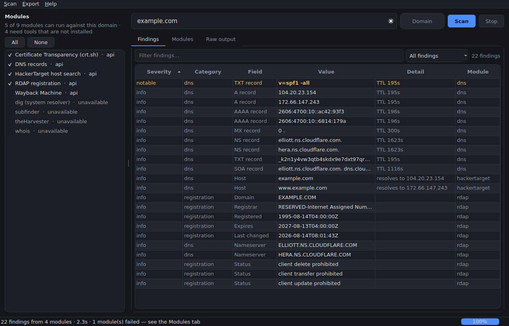
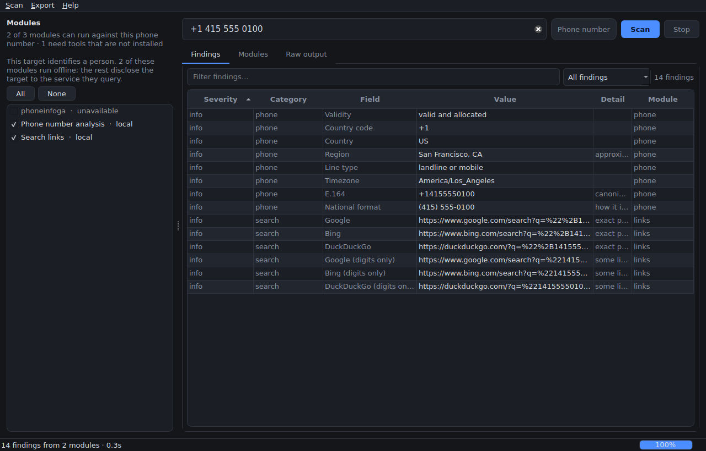
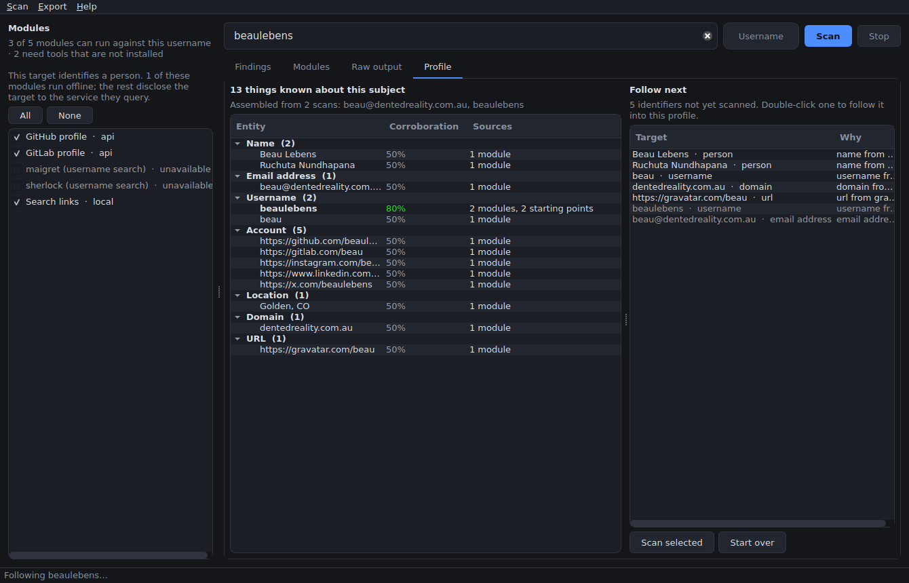

# Wosint

A desktop OSINT workbench. Wosint puts local reconnaissance tools and public
web APIs behind one Qt interface: type a target, pick your modules, and get
every result normalised into a single searchable table.

Everything is written in Python, including the interface — the frontend is
PySide6 (Qt), not a web app.



Scanning a phone number, with the two offline modules selected and the sidebar
noting that the target is a person:



The Profile tab, after following a lead from an email address to a username —
the handle is at 80% because two modules found it from two different starting
points:



## Why

Reconnaissance normally means running half a dozen tools by hand and reading
half a dozen different output formats. Wosint runs them concurrently against
one target and folds the results into a common shape, while keeping every
tool's raw output one click away.

It handles both halves of a normal investigation: infrastructure (domains, IP
addresses, URLs) and people (email addresses, usernames, phone numbers, names,
photographs). Findings from every scan are correlated into one profile, so
following a lead adds to the picture instead of starting a new one.

Modules come in three kinds and the interface treats them identically:

- **API modules** query public endpoints over HTTPS. They need nothing
  installed and work out of the box.
- **CLI modules** shell out to tools you already have. When a tool is missing
  the module is shown greyed out with an install hint rather than failing
  mid-scan.
- **Local modules** work the target out on this machine and send nothing
  anywhere. The interface labels them, so when the target is a person you can
  see at a glance which modules disclose them to a third party and which do not.

## Install

Requires Python 3.10 or newer.

```bash
git clone https://github.com/PartialDifferentialEquation/Wosint
cd Wosint
python -m venv .venv && source .venv/bin/activate
pip install -e ".[dev]"
```

`pip install -r requirements.txt` installs the runtime dependencies alone, for
running Wosint without installing the package itself. The `[dev]` extra above is
what you want if you also intend to run the tests.

On a headless Linux box, Qt also needs its system libraries:

```bash
sudo apt install libegl1 libgl1 libxkbcommon-x11-0 libdbus-1-3 libfontconfig1 libxcb-cursor0
```

## Use

Open the desktop application:

```bash
wosint              # or: python -m wosint
```

Type a target and press Enter. Wosint classifies the input as you type — the
line under the box says how it was read — and the sidebar narrows to the modules
that apply.

Detection has to take the safest reading of an ambiguous string, which is not
always the right one: `Beau` looks exactly like a username, and a bare run of
digits looks like a phone number. The **type selector** beside the box overrules
it, so you can say *this is a person's name* and have it treated as one. An
override still has to be possible — forcing `not a domain!!` to be a domain is
refused rather than producing a target no module can use.

**Open photo…** (`Ctrl+O`) picks an image to examine, and a photo can be read
for different things: pick **where it was taken** and the analysis prioritises
street names, signage language, road markings, plate formats, architecture and
vegetation; pick **the people in it** and it looks for name tags, employer
logos, lanyards and event branding instead. Either way it reads what the picture
*says*, never who it shows.

The same engine runs from a terminal, which is useful for scripting and on
machines without a display:

```bash
wosint scan example.com                    # every applicable module
wosint scan example.com -m dns -m rdap     # just these two
wosint scan 1.2.3.4 --json > scan.json     # machine-readable
wosint scan bob@example.com                # email: provider, profiles, accounts
wosint scan "+1 415 555 0100" -m phone     # offline number analysis
wosint scan "Ada Lovelace"                 # person: records, filings, dockets
wosint scan ~/photos/IMG_4021.jpg -m exif  # offline image metadata
wosint modules                             # catalogue and availability
```

### Targets

Wosint works out what you gave it, and modules declare which kinds they
understand — there is no point offering a username lookup for an IP address, so
it is not shown.

| You type | Read as |
| --- | --- |
| `example.com`, `a.example.co.uk` | Domain |
| `1.2.3.4`, `2001:db8::1` | IP address |
| `https://example.com/path` | URL |
| `bob@example.com` | Email address |
| `some_user` | Username |
| `+1 415 555 0100`, `(415) 555-0100`, `00 44 20 7183 8750` | Phone number |
| `Ada Lovelace`, `Renée O'Brien` | Person |
| `~/photos/IMG_4021.jpg` | Image (the file must exist) |

Any of these can also be chosen explicitly rather than detected.

Classification is deliberately conservative where two readings are possible. A
dotted number like `415.555.0100` is a phone number rather than a domain, since
no real TLD is numeric; `user.name-1` is a username for the same reason. A
single word is read as a username rather than a name, because a handle is the
more useful reading. Whatever it decides, the badge beside the input shows it
before you press Enter.

A phone number typed without a country code is genuinely ambiguous. Wosint says
so rather than guessing — set `WOSINT_PHONE_REGION` (for example `GB`) to have
such numbers interpreted for that country.

### Modules

| Module | Kind | Targets | What it finds |
| --- | --- | --- | --- |
| `rdap` | api | domain, ip, url, email | Registrar, registration dates, nameservers, status flags |
| `dns` | api | domain, ip, url, email | A/AAAA/MX/NS/TXT/SOA over DNS-over-HTTPS, PTR for addresses |
| `crtsh` | api | domain, url, email | Subdomains and issuers from Certificate Transparency logs |
| `hackertarget` | api | domain, ipv4, url, email | Passive host search and reverse-IP lookups |
| `geoip` | api | ipv4, ipv6 | Location, ISP, ASN, hosting and proxy classification |
| `wayback` | api | domain, url, email | Historical URLs from the Internet Archive |
| `whois` | cli | domain, ip, url, email | Registration record from the local `whois` client |
| `dig` | cli | domain, ip, url, email | Records as seen by *this* machine's resolver |
| `subfinder` | cli | domain, url, email | Passive subdomain enumeration across aggregated sources |
| `theharvester` | cli | domain, url, email | Emails and hostnames from search engines and datasets |
| `sherlock` | cli | username, email | Accounts matching a username across social platforms |

Person-oriented modules:

| Module | Kind | Targets | What it finds |
| --- | --- | --- | --- |
| `email` | local | email | Role vs. individual mailbox, provider class, sub-address tags, probable name |
| `phone` | local | phone | Country, region, carrier, line type, timezone and dialling formats |
| `links` | local | person, username, email, phone | Ready-made search queries and candidate profile URLs |
| `gravatar` | api | email | Public profile, avatar, and the accounts linked from it |
| `github` | api | username, email | Name, employer, location and published email on a GitHub profile |
| `gitlab` | api | username, email | GitLab profile for a handle |
| `hibp` | api | email | Breaches containing an address (needs an API key) |
| `holehe` | cli | email | Sites where an address is already registered |
| `maigret` | cli | username, email | Wide username search that also extracts profile details |
| `phoneinfoga` | cli | phone | Online scanner results for a number |

Public records and images:

| Module | Kind | Targets | What it finds |
| --- | --- | --- | --- |
| `exif` | local | image | GPS position, timestamps, camera, serial numbers, authorship |
| `records` | local | person, domain, email | Search URLs for registries that have no API |
| `wikidata` | api | person, username | Structured biography and self-declared accounts |
| `sec` | api | person, domain, email | US securities filings naming a person or company |
| `courtlistener` | api | person, domain | US federal and state court dockets |
| `opensanctions` | api | person, domain | Sanctions, watchlist and PEP entries (needs a key) |
| `opencorporates` | api | person | Directorships and officerships (needs a key) |
| `vision` | api | image | Text, handles, signage and context read out of a photo, via Gemini (needs a key) |

The `local` modules never touch the network. `email`, `phone`, `links`, `exif`
and `records` therefore work offline, and give you something to go on before
deciding whether to make any outbound query at all.

CLI modules are optional. Install only the ones you want:

```bash
sudo apt install whois dnsutils
pipx install sherlock-project theHarvester holehe maigret
go install github.com/projectdiscovery/subfinder/v2/cmd/subfinder@latest
# phoneinfoga: https://sundowndev.github.io/phoneinfoga/install/
```

### Reading results

Findings carry a severity that reflects **notability, not vulnerability** —
Wosint reports what is publicly observable and leaves the judgement to you. A
domain that publishes MX records but no SPF policy is flagged as a warning
because it is spoofable; a `staging.` subdomain in a certificate log is marked
notable because it is worth a look.

The **Findings** tab is filterable by text and by severity. **Modules** shows
what ran, how long it took and why anything failed. **Raw output** keeps each
tool's untouched output, so nothing is hidden behind the parser. Double-click
any cell to copy it. `Ctrl+S` exports the whole scan as JSON; the Export menu
also writes the visible findings to CSV.

### Building a picture

The **Profile** tab is where separate scans become one subject. Every finding is
read for the *thing* it was about — a name, an address, a handle, an employer, a
location — and those are normalised and merged, so `Bob@Example.COM` from a
Gravatar profile and `bob@example.com` from a GitHub profile become one entity
with two sources rather than two rows.

Confidence counts **independent corroboration**, not repetition: one module
saying something six times is still one source, while two modules reaching it
from two different starting points is a genuine cross-check. Hovering an entity
shows every claim behind it and which module made it — nothing in a profile is
unattributable.

**Follow next** lists the identifiers found so far. Double-click one and Wosint
scans it and folds the results into the same profile, so a chain like

```
bob@example.com  →  Gravatar profile  →  linked GitHub account
                 →  handle "bobsmith"  →  rescan  →  employer, location, more accounts
```

happens in four clicks, with each step recorded.

#### Inferences are marked, and never chained

Some findings rest on a guess. Trying an email's local part as a GitHub handle
sometimes finds the right person and sometimes finds a stranger who happens to
share it; a name matching a court docket may be a different person entirely.
Wosint marks those claims as **inferred**: they are shown greyed and italic as
unconfirmed, they are capped at low confidence however many modules repeat them,
and they are **never offered as pivots** — because chaining a scan off a guess is
exactly how two people get merged into one profile. A single confirmed source
promotes an inferred entity to a real one.

### Images

Point Wosint at a photograph and it reads what the file already carries: GPS
position, timestamps, camera model and serial number, and any authorship fields
the camera or editor wrote. That runs entirely offline, and a recorded position
is flagged as a warning because it places someone somewhere at a time.

The `vision` module additionally asks Gemini to read the picture for
**identifiers that can be looked up** — text on signage, a handle visible on a
screen, a company on a vehicle, a recognisable street. Those feed the same
profile as everything else, always marked as inferred.

It does not do face recognition. The model is instructed not to identify anyone
from their face and not to guess at protected characteristics, and no biometric
data is extracted or stored. Wosint links on what an image *says*, not on who it
*shows* — face matching against a person is the capability that turns an OSINT
tool into a surveillance one, and it is deliberately absent.

## Configuration

**Settings → Advanced settings…** (`Ctrl+,`) is the easiest way in. It has three
tabs: **API keys** for the modules that need one, **Scanning** for timeouts,
concurrency and the details some sources insist on knowing about the caller, and
**Modules** for switching a source off entirely so it never runs whatever the
target.

Keys you type are written to your own config file, which is created owner-only
(`0600`) because it holds secrets. A key supplied through the environment is
shown masked and marked *environment*, but cannot be edited there — the file
value would be ignored on the next load, so accepting the edit would be a lie —
and it is never copied into the file by a save.

Settings live in `~/.config/wosint/config.json` and every value can be
overridden by an environment variable:

```json
{
  "module_timeout": 45.0,
  "max_concurrency": 6,
  "http_timeout": 20.0,
  "disabled_modules": []
}
```

| Variable | Effect |
| --- | --- |
| `WOSINT_CONFIG` | Use a different config file |
| `WOSINT_MODULE_TIMEOUT` | Seconds before a module is killed |
| `WOSINT_MAX_CONCURRENCY` | How many modules run at once |
| `WOSINT_HTTP_TIMEOUT` | Per-request timeout for API modules |
| `WOSINT_DISABLED_MODULES` | Comma-separated modules to hide entirely |
| `WOSINT_PHONE_REGION` | Two-letter region for numbers typed without a country code |
| `WOSINT_CONTACT_EMAIL` | Contact address for registries that require one (the SEC) |
| `WOSINT_VISION_MODEL` | Model used for image analysis (default `gemini-3.1-pro-preview`) |
| `WOSINT_KEY_<MODULE>` | API key for a module that needs one, e.g. `WOSINT_KEY_HIBP` |

Modules needing a key: `hibp`, `opensanctions`, `opencorporates`, and `vision`
(`WOSINT_KEY_VISION`, or the usual `GEMINI_API_KEY` / `GOOGLE_API_KEY`).
`courtlistener` works without one; a token only raises its rate limit.

`vision` calls Gemini, defaulting to `gemini-3.1-pro-preview`. Point it at a
different model with `WOSINT_VISION_MODEL` — no code change needed.

A malformed config file is ignored rather than fatal — Wosint starts with
defaults instead of refusing to open over a stray comma.

## How it fits together

```
wosint/
  core/         the engine: targets, models, registry, runner, subprocess and HTTP helpers
                plus entities.py and correlate.py, which merge findings into a profile
  modules/      one file per source, all behind the same Module interface
  gui/          the only package that imports Qt
  cli.py        headless interface over the same engine
```

The engine is plain asyncio and knows nothing about Qt. The GUI runs it on a
background thread with its own event loop and receives progress as Qt signals,
which Qt delivers as queued calls on the GUI thread — so no widget is ever
touched from the worker, and a slow module never freezes the window.

One module failing never affects another: every error, timeout and missing tool
becomes a status on that module's row, and the scan carries on.

### Adding a module

Subclass `ApiModule` or `CliModule`, declare what it supports, and register it:

```python
@register
class MyModule(ApiModule):
    name = "mysource"
    title = "My source"
    supported_types = frozenset({TargetType.DOMAIN})

    async def execute(self, target, ctx):
        out = ModuleOutput()
        data = await get_json(ctx.client, f"https://example.com/api/{target.value}")
        out.add("dns", "Host", data["host"])
        return out
```

Add it to the import list in `wosint/modules/__init__.py` and it appears in
both the GUI and the CLI. Nothing else needs to change.

## Development

```bash
QT_QPA_PLATFORM=offscreen pytest
```

The suite runs without network access and without any of the CLI tools
installed: API modules are tested against mocked HTTP responses, CLI modules
are tested by feeding captured output to their parsers, and the GUI tests run
against Qt's offscreen platform.

## Authorised use only

Wosint gathers information from public sources, but "passive" is not the same
as "permitted". Only run it against infrastructure you own or have written
authorisation to assess. Some modules query third-party services — the module
list shows which — and those services have their own terms and rate limits.

Searching for a person raises a second question on top of that one. An email
address, a username, a phone number and a name are personal data, and in most
jurisdictions collecting them needs a lawful basis regardless of how public each
individual fact is; assembling scattered public details into one profile is
exactly the step that regulators treat as processing. Wosint therefore says so
in the sidebar whenever the target is a person, and tells you which of the
selected modules would disclose that person to a third party just by asking
about them. Have a reason, keep the results no longer than you need them, and do
not use this to build a profile of someone who has not consented and whom you
have no authorisation to investigate.

Correlation raises the stakes rather than lowering them. Individually harmless
facts become a profile once they are joined up, and that assembly is the step
regulators treat as processing — which is why every entity keeps its sources,
why guesses are marked and never chained, and why you should delete an
investigation when it is done.
